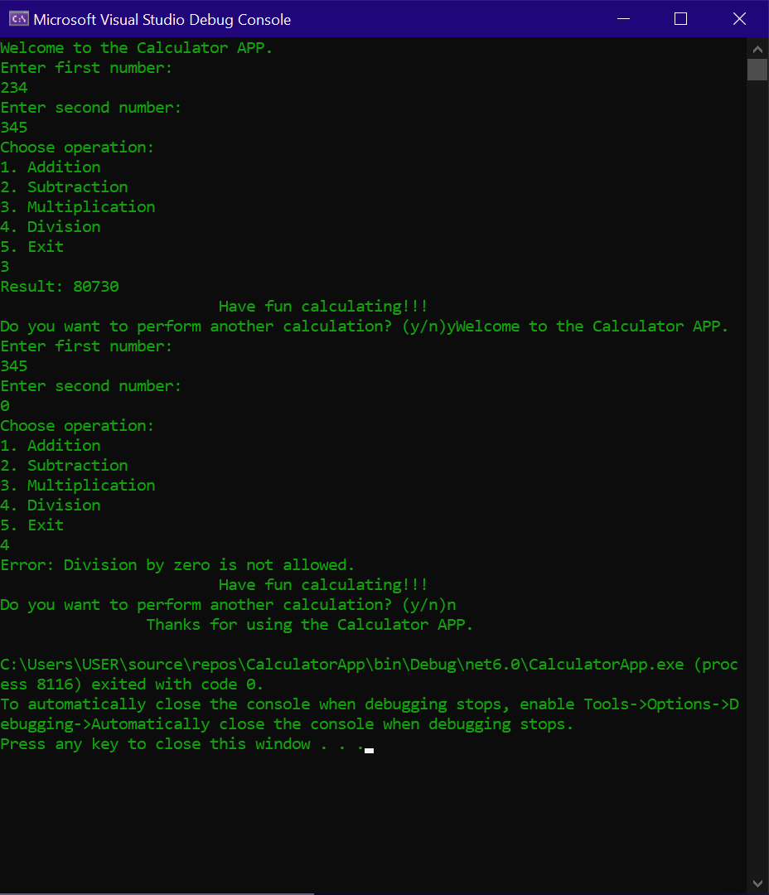

# Calculator Console App


A simple console-based calculator application built using C#.



## Features

- **Conveniency:** Supports basic arithmetic operations (addition, subtraction, multiplication, division).
- **Friendly UI:** Provides a command-line interface for user input and interaction.
- **Error handling** Handles edge cases and error scenarios gracefully.

## Getting Started

- These instructions will help you get a copy of the project up and running on your local machine for development and testing purposes.

### Prerequisites

- [.NET Core SDK](https://dotnet.microsoft.com/download) installed on your machine.

### Installation

1. Clone the repository to your local machine.

```bash
git clone https://github.com/A1pha4/Calculator-APP.git
```
2 Navigate to the project directory.
```bash 
cd Calculator-APP
```
3. Compile and run the application.
```bash
dotnet run
```
### Usage
Run the application and follow the on-screen instructions to perform calculations.
Input valid mathematical expressions following the prompts.

### Contributing
If you'd like to contribute, please fork the repository and then create a pull request.See [CONTRIBUTING](https://github.com/A1pha4/Calculator-APP/blob/main/CONTRIBUTING.md) file

### License
This project is licensed under the MIT License. See [LICENSE](https://github.com/A1pha4/Calculator-APP/blob/main/LICENCE.txt) file.

### Authors and Acknowledgments
- *Owen Murunga*
- *Joseph Ochieng*
- *Amos Nzuki*
- *Deche Wilson*
- *Tamima Shee*
- *Joseph Matiko*
- *Winfred Mawia*
- *James Kiala*
- *Abdulkadir Said*
- Microsoft Docs - C#

### Contact and Support 
- *abdulkadirsaid2103@gmail.com*
- *josephochieng922@gmail.com*
- *owenhood80@gmail.com*
- *jeyzwilinsco@gmail.com*
- *sheetamima@gmail.com*
- *amosnzuki2003@gmail.com*
- *matish9409@gmail.com*
- *winfredmawia94@gmail.com*
- *jameskiala54@gmail.com*
